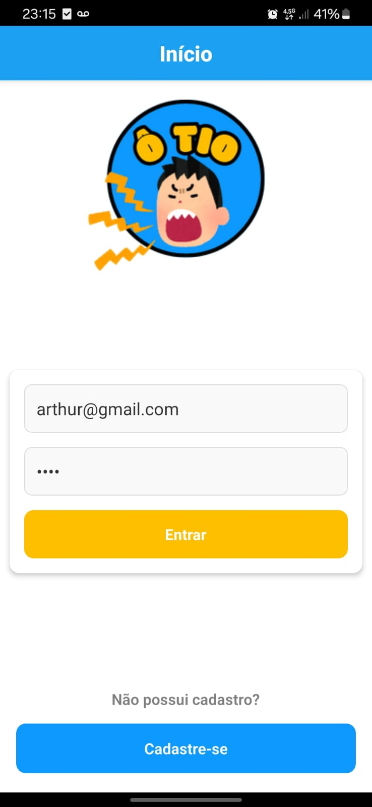
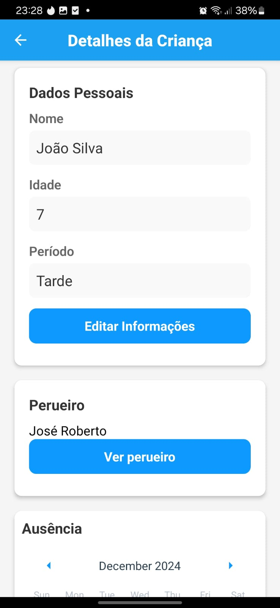
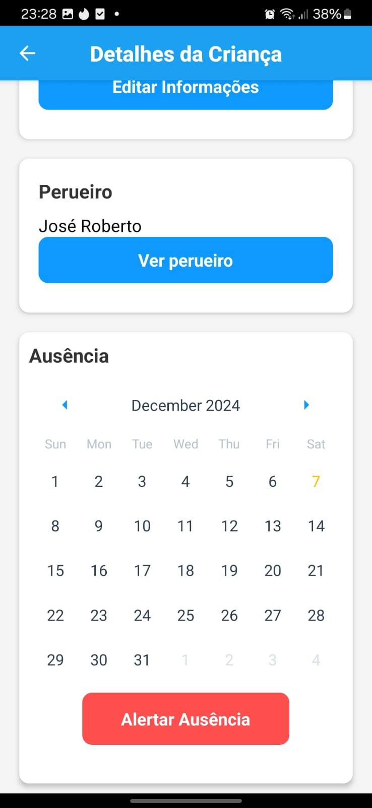
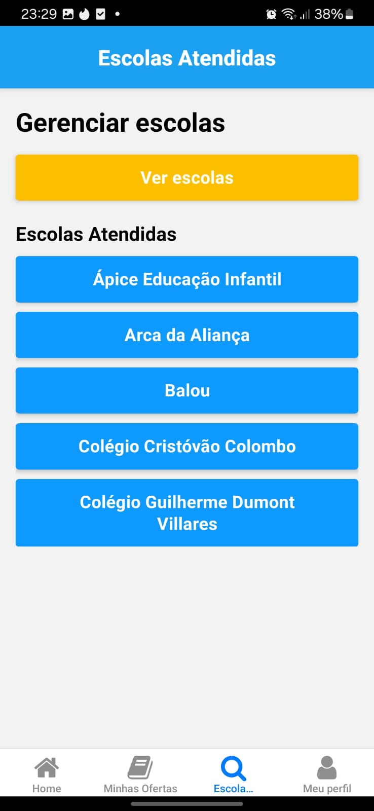
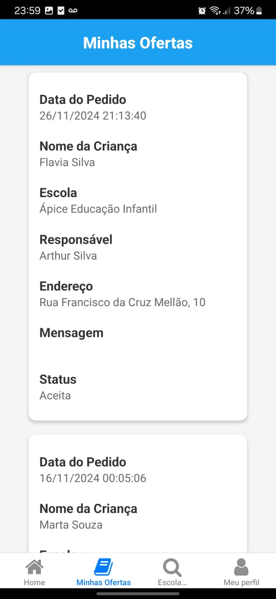
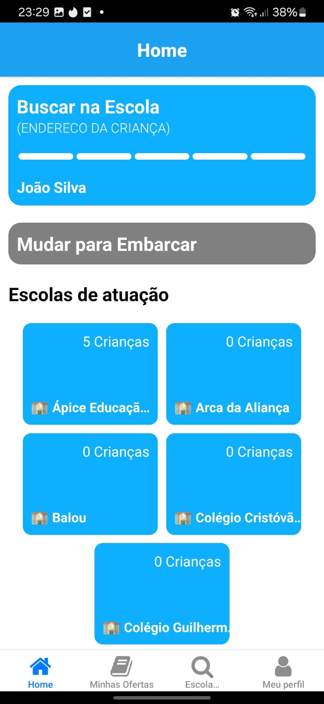
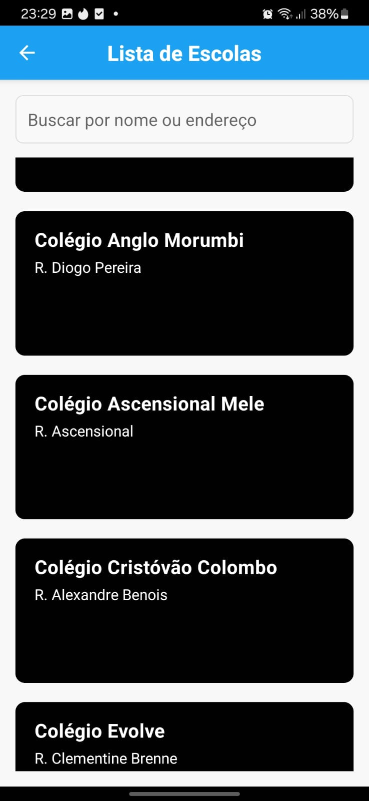

# OTIO - Aplicativo Mobile de Conexão Pais e Perueiros 🚀

## 📘 Visão Geral

O **OTIO** é um aplicativo mobile desenvolvido em **React Native** e com backend em **Java Spring Boot**, projetado para conectar pais responsáveis e perueiros. O objetivo é facilitar a busca por transporte escolar, organizar as rotas e proporcionar a personalização das informações das crianças e vans. A plataforma busca oferecer funcionalidades robustas tanto para pais responsáveis quanto para perueiros e gestores das escolas.

---

## 🧑‍🤝‍🧑 Equipe de Desenvolvimento

- **Arthur Silva**  
- **Kayke Ribeiro**  
- **Eliseu Ferreira**  
- **Samuel Levi**  
- **Thales Oliveira**  
- **Lucas Mendes**  
- **Alexsandro Alves**

---

## 🚀 Tecnologias Utilizadas

- **Frontend:** React Native  
- **Backend:** Java Spring Boot  
- **Banco de Dados:** MySQL  
- **Segurança:** Spring Security  
- **Padrão de Arquitetura:** MVC  

---

## 📌 Funcionalidades do Sistema

### 📌 Para Pais Responsáveis

- **Cadastro e Login**  
  Interface intuitiva para cadastro e login dos pais responsáveis.  
    

- **Buscar Perueiros**  
  Interface para procurar perueiros que atendem às escolas das crianças.  
    

- **Solicitar Propostas**  
  Pais podem solicitar propostas diretamente aos perueiros para transporte escolar.  

- **Gerenciar Ausências das Crianças**  
  Interface para informar e gerenciar a ausência das crianças de forma rápida e prática.  
    

- **Perfil Responsável**  
  Perfil personalizável com foto e informações relevantes.  
    

---

### 📌 Para Perueiros

- **Gerenciamento de Perfil e Van**  
  Interface para personalizar o perfil e os detalhes das vans.  
    

- **Gerenciar Rotas e Escolas**  
  Vinculação das escolas e gerenciamento das rotas e informações das crianças.  
    

- **Emitir Ofertas**  
  Perueiros criam ofertas para pais, facilitando a comunicação e vínculo.  
    

- **Home Interface**  
  Tela principal do perueiro com todas as informações em destaque.  
    

---

### 📌 Backoffice Administrativo (Para Gestores das Escolas)

- **Gestão das Escolas**  
  Visualização e controle das escolas cadastradas no sistema.  

- **Gestão Centralizada**  
  Ferramentas administrativas para gerenciar todos os dados e funcionalidades do sistema.  
    

---

## 🔐 Segurança do Sistema

- **Spring Security** para autenticação e controle de acesso robusto.
- Controle de acesso personalizado para pais, perueiros e administradores.

---

## 📁 Estrutura do Projeto

### 🔹 Backend (Spring Boot)
- **Model:** Representação das entidades (Pais, Perueiros, Escolas, Crianças).
- **Controller:** Conecta a View ao Model e gerencia as requisições HTTP.
- **View:** Interface no frontend React Native.

### 🔹 Frontend (React Native)
Interface responsiva e fácil de usar para interagir entre pais e perueiros.

---

## ⚛️ Configuração do Projeto

### 🔹 Backend (Spring Boot)
1. Configure o banco de dados MySQL.
2. Ajuste as propriedades `application.properties`.
3. Compile e inicie o projeto com:  
   ```bash
   ./mvnw

---

## 📜 Licença

- Este projeto segue os termos acadêmicos e educativos do SENAC e é destinado ao aprendizado e uso não comercial.

---

## 🙌 Agradecimentos

- Obrigado aos membros da equipe que tornaram esse projeto possível:
- Arthur, Kayke, Eliseu, Samuel, Thales, Lucas e Alexsandro.

---
